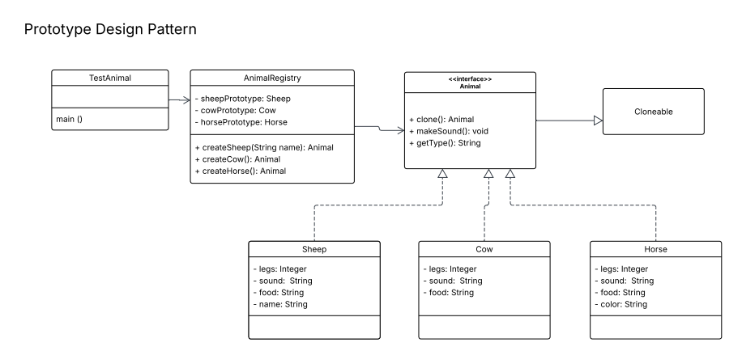

# Prototype Design Pattern: Animal Registry

This project demonstrates the **Prototype Design Pattern** in Java. It allows for the creation of new animal objects by cloning pre-configured "prototype" instances, which avoids the overhead of manual instantiation and helps manage object creation through a centralized registry.

---

## Core Concepts

The Prototype pattern is particularly useful when the cost of creating a new object is expensive or when you want to hide the complexity of specific class instantiations from the client.

* **Interface-Based:** All animals implement a common `Animal` interface, ensuring a consistent contract for cloning and behavior.
* **Decoupling:** The `AnimalRegistry` acts as a factory that manages the prototypes, so the main application doesn't need to know the specific details of how a `Sheep`, `Cow`, or `Horse` is constructed.
* **Cloning:** Instead of using the `new` keyword repeatedly in the logic, the system is designed to return copies of existing objects.

---

## Class Structure

### 1. The Prototype Interface (`Animal.java`)
Defines the essential behaviors for every animal in the system. The critical method here is `clone()`, which is the heart of the Prototype pattern.

### 2. Concrete Implementations
These classes represent the specific objects we want to replicate:
* **`Sheep.java`**: Includes specific properties like `name`.
* **`Cow.java`**: Includes properties like `sound` and `food`.
* **`Horse.java`**: Includes aesthetic properties like `color`.

### 3. The Registry (`AnimalRegistry.java`)
This class initializes "master" copies of each animal upon startup. When a user requests a sheep, cow, or horse, the registry provides the pre-instantiated prototype.

---

## UML Diagram

